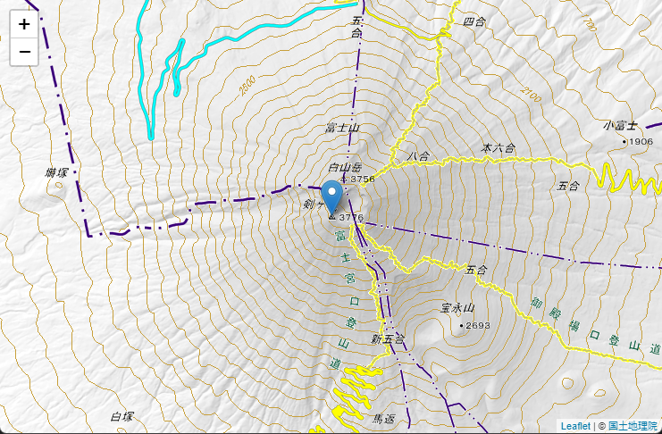

# React-leafletで国土地理院の地図を表示するサンプル

## はじめに

地図データは国土地理院のデータを利用しています。出展の明示のみで利用可能です。

[地図の利用手続パンフレット](https://www.gsi.go.jp/common/000223838.pdf)より抜粋
```
●国土地理院サーバー上の地理院タイルをリアルタイムで読み込み表示するウェブサイト等を作成する場合、
申請は必要ですか？
➡ リアルタイムでの読込みは、出典の明示のみで申請不要です。出典は、「国土地理院」、「地理院タイル」等と記載してい
ただき、地理院タイル一覧ページ（https://maps.gsi.go.jp/development/ichiran.html）へのリンクを付けてください。
```


## 前提

* Reactの基本的な機能を理解していること

## React-Leaflet のインストール
```
$ npx create-react-app leaflet-sample-map --template typescript --use-npm
$ cd leaflet-sample-map
$ npm i leaflet react-leaflet
$ npm i -D @types/leaflet
```

## ①最小限の地図サンプル

* 地図とマーカーを表示します
* ドラッグ＆ドロップによる移動や、マウスホイールによる拡大縮小もできます




### ①-1位置を表すアイコン(Marker)の読み込み

React-leafletの不具合？でアイコンが読み込まれないため、最初にアイコンを読み込む処理を作ります。

src/utils/initLeaflet.ts

```tsx
import Leaflet from 'leaflet';
import icon from 'leaflet/dist/images/marker-icon.png';
import iconShadow from 'leaflet/dist/images/marker-shadow.png';

// marker setting
let DefaultIcon = Leaflet.icon({
  iconUrl: icon,
  shadowUrl: iconShadow,
  iconAnchor: [12, 41], // アイコンのとがった位置をクリックした場所に合わせるためのオフセット
});
Leaflet.Marker.prototype.options.icon = DefaultIcon;

```

### ①-2マップ表示機能ソース

* [react-leaflet](https://react-leaflet.js.org/)で地図を表示します
* `leaflet/dist/leaflet.css`を読み込みます(忘れると表示が崩れます)
* `①-1`で作成したソースを読み込み、位置表示アイコンをロードします
* 国土地理院の地図タイルを`<TileLayer>`で読み込みます
* 位置表示アイコンを`<Marker>`で表示します


App.tsx

```tsx
import React, { VFC } from 'react';
import { MapContainer, TileLayer, Marker, Popup } from 'react-leaflet';
import { LatLng } from 'leaflet';
import 'utils/initLeaflet';
import 'leaflet/dist/leaflet.css';
import './App.css';

const App: VFC = () => {
  const position = new LatLng(35.3607411, 138.727262);  // 富士山頂

  return (
    <div className="App">
      <MapContainer center={position} zoom={13}>
        <TileLayer
          attribution='&copy; <a href="https://maps.gsi.go.jp/development/ichiran.html">国土地理院</a>'
          url="https://cyberjapandata.gsi.go.jp/xyz/std/{z}/{x}/{y}.png"
        />
        <Marker position={position}>
          <Popup>
            A pretty CSS3 popup. <br /> Easily customizable.
          </Popup>
        </Marker>
      </MapContainer>
    </div>
  );
};

export default App;
```

### ①-3マップを全画面表示するためにCSSを変更

App.css

```css
/* 地図を画面全体に表示 */
.leaflet-container {
  width: 100vw;
  height: 100vh;
}

/* カーソルを標準に戻す(標準の手アイコンは位置を正確に選択しづらい) */
.leaflet-grab {cursor: auto;}
```

### ①-4ブラウザで表示して動作を確認

```bash
npm run start
```
---
